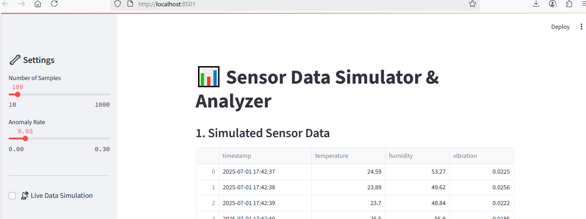
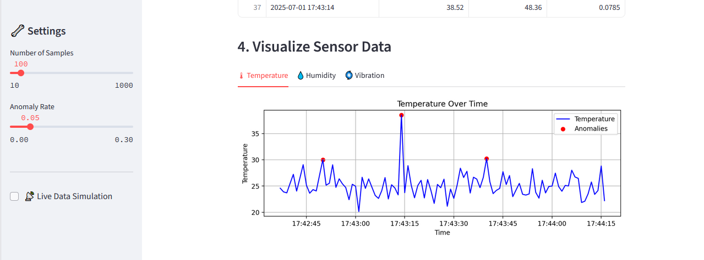
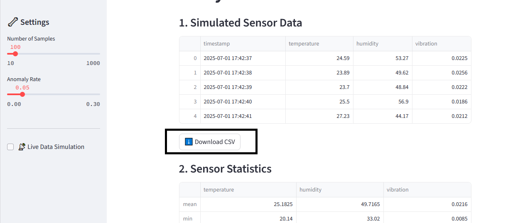

# 📊 Sensor Data Simulator & Analyzer

An interactive Python project that **simulates sensor data**, performs **real-time anomaly detection**, and visualizes data through a **Streamlit web app**. This tool is designed for testing data pipelines, dashboards, and anomaly detection systems without the need for real sensor hardware.

---

## 🚀 Features

- ✅ Sensor data simulation (Temperature, Humidity, Vibration)
- ✅ Configurable number of samples and anomaly injection rate
- ✅ Real-time live mode simulation (1 sample per second)
- ✅ Anomaly detection with user-defined thresholds
- ✅ Downloadable CSV files of simulated data
- ✅ Clean, tab-based visualizations for each sensor
- ✅ Unit-tested simulator and analyzer modules
- ✅ Ready for deployment on Streamlit Cloud

---

## 🛠 Technologies Used

- **Python 3**
- **Streamlit** – Interactive web app framework
- **Pandas** – Data handling and manipulation
- **Matplotlib** – Data visualization
- **NumPy** – Data simulation and randomness
- **Pytest** – Unit testing framework

---

## 📂 Project Structure

```text
sensor-sim-analyzer/
├── sensor_simulator_app.py                # Streamlit web app
├── sensor_simulator.py   # Data simulation logic
├── data_analyzer.py      # Data analysis and anomaly detection
├── visualizer.py         # Visualization module (optional extension)
├── requirements.txt      # Python package requirements
└── tests/
    ├── test_simulator.py # Unit tests for simulator
    └── test_analyzer.py  # Unit tests for analyzer

🚀 How to Run Locally

    Clone the repository

git clone https://github.com/SruthiKondiparthy/sensor-sim-analyzer.git
cd sensor-sim-analyzer

    Install dependencies

pip install -r requirements.txt

    Run the Streamlit app

streamlit run sensor_simulator_app.py

    Explore the app in your browser at:

http://localhost:8501

### 📊 Sensor Data Simulation


### 📈 Sensor Visualization Tabs


### 📥 CSV Download Button


Add screenshot here
🌐 Live Demo (Optional)

👉 Deployed App on Streamlit Cloud
Will update this link after deployment.
✅ Future Enhancements

    Real-time updating plots

    FastAPI backend for API-based simulation

    Docker containerization

    Multi-sensor live streaming with chart animations

👩‍💻 Author

Sruthi Ravuru Kondiparthy
LinkedIn | GitHub
⭐ If you like this project, please star the repository!


